자취생을 위한 레시피 추천 사이트
=============

### 프로젝트 정의
   자취생들이 모여 자신이 만든 요리를 공유하고, 레시피와 요리 팁, 음식재료 구입
   팁 등을 나누며 지식과 경험을 공유하는 공간 만들기

### 프로젝트 배경
현대 사회에서 혼자 살아가는 자취생들의 문제점 중 하나인 식사 문제를 해결하고, 자취생들이 더 나은 요리 경험과 친목을 형성할 수 있는 공간을 제공하고자 선정하
였다. 많은 자취생들이 요리를 처음 시작하는 경우가 많기 때문에 자취생들을 위한 요리
커뮤니티를 만들어 다양한 요리를 배우고, 경험을 나누며 서로 지식과 경험을 공유
하는데 도움을 준다.

### 프로젝트 목표
가. 가지고 있는 재료만으로 만들 수 있는 요리 추천
선택된 재료들을 바탕으로 데이터베이스 또는 API를 활용하여 레시피 리스트를 추
출하고, 추출된 레시피 리스트에서 사용자가 선택한 재료들과 일치하는 재료들이
최대한 많은 레시피들을 추천

   나. 요리 레시피 공유를 위한 게시판 만들기
사용자가 레시피를 등록할 수 있는 폼을 디자인하고, 사용자가 입력한 정보를 데이
터베이스에 저장하는 등록 기능을 구현

### 프로젝트 구조

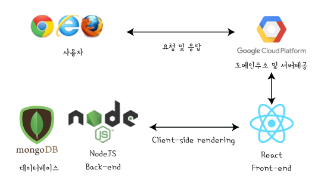
### 메인화면
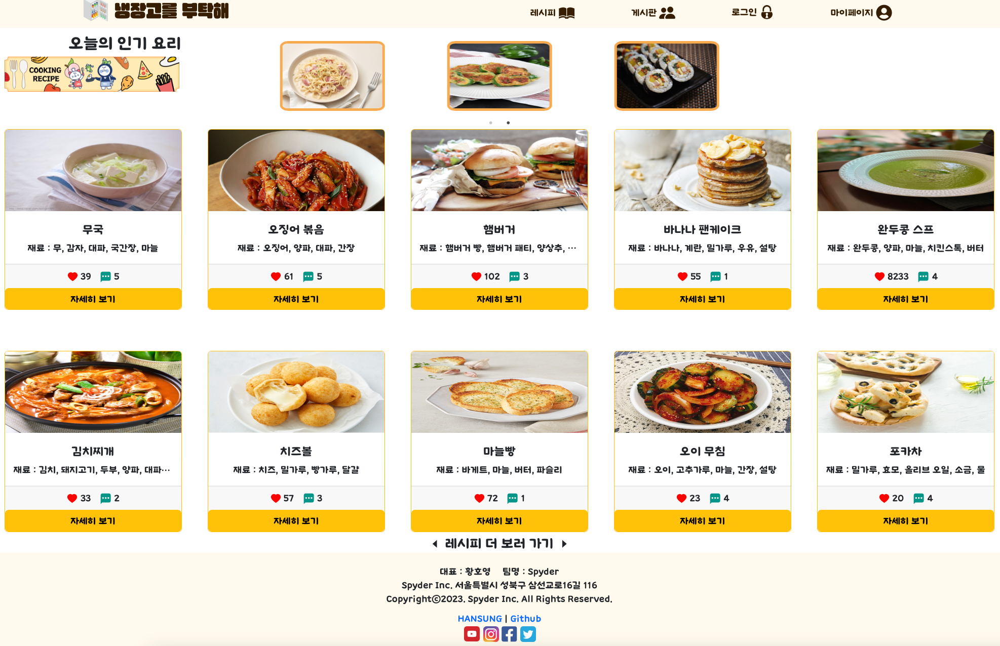
### 검색화면
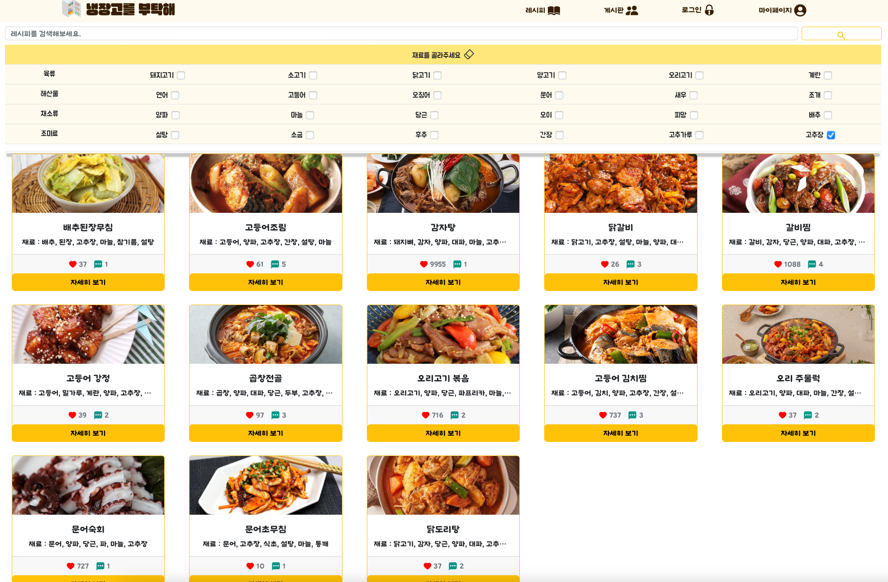
검색 기능을 제공합니다. 재료 체크박스를 클릭하면 그에 해당하는 재료가 들어간 요리를 보여줍니다. 중복으로 체크하면 재료들이 모두 포함된 레시피가 보여집니다. 사진을 클릭하면 상세페이지로 이동합니다.
### 상세페이지
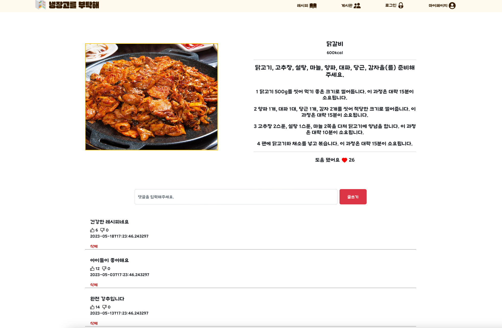
레시피에 좋아요 및 댓글과 같은 반응을 남길수 있습니다.
### 게시판
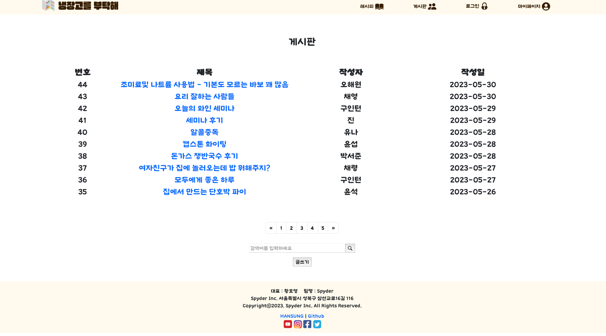
게시판 검색 기능을 제공합니다.
### 글작성 페이지
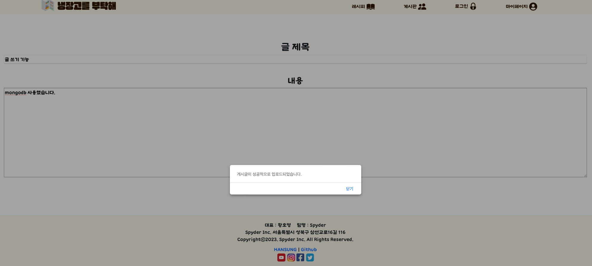
글작성 기능을 지원합니다.
### 작성한 글 확인
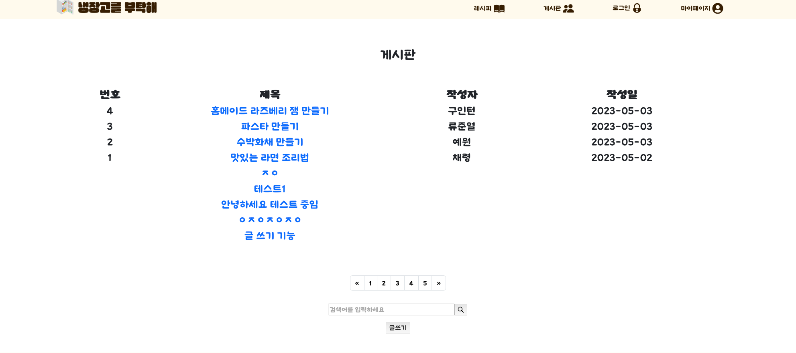
### 댓글작성 기능
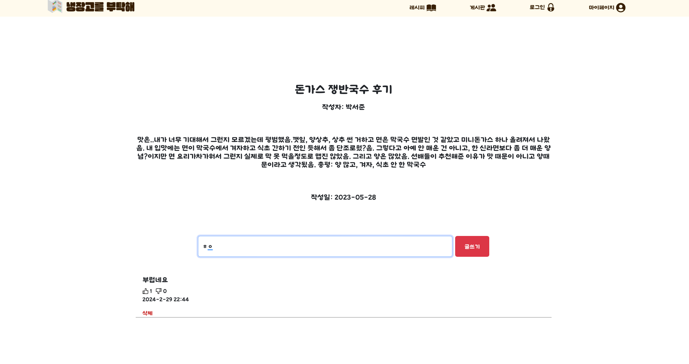
댓글로 게시판 글에 반응을 남길 수 있습니다.
### 로그인 및 회원가입
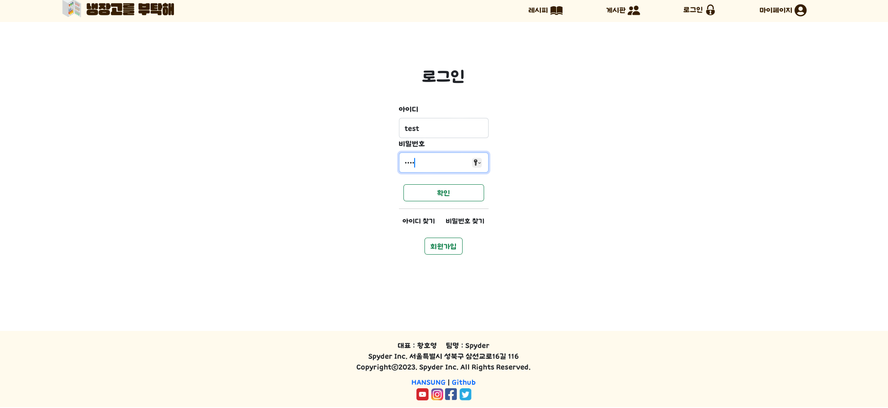
### 마이페이지
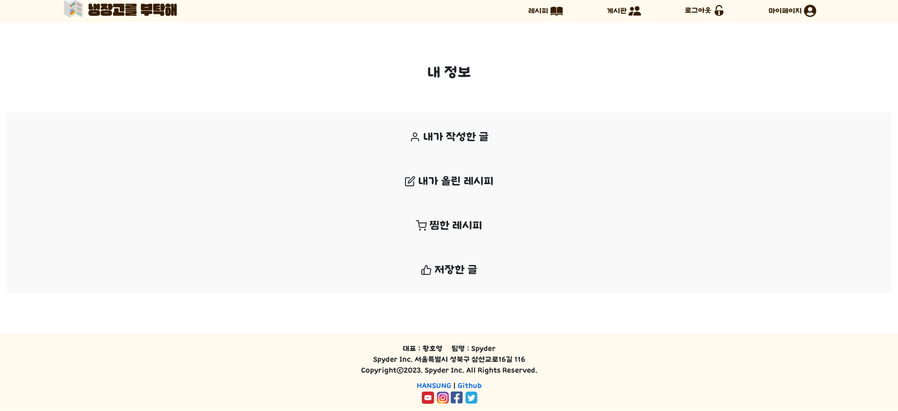
로그인 했을시 접근 가능한 마이페이지 기능을 보여줍니다.
### 역할분담
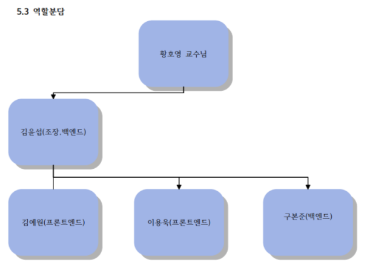

### 수행일정
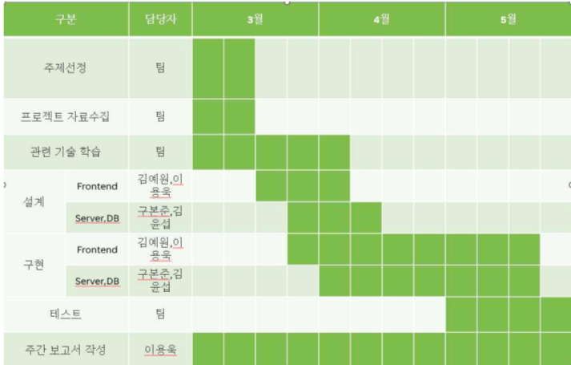